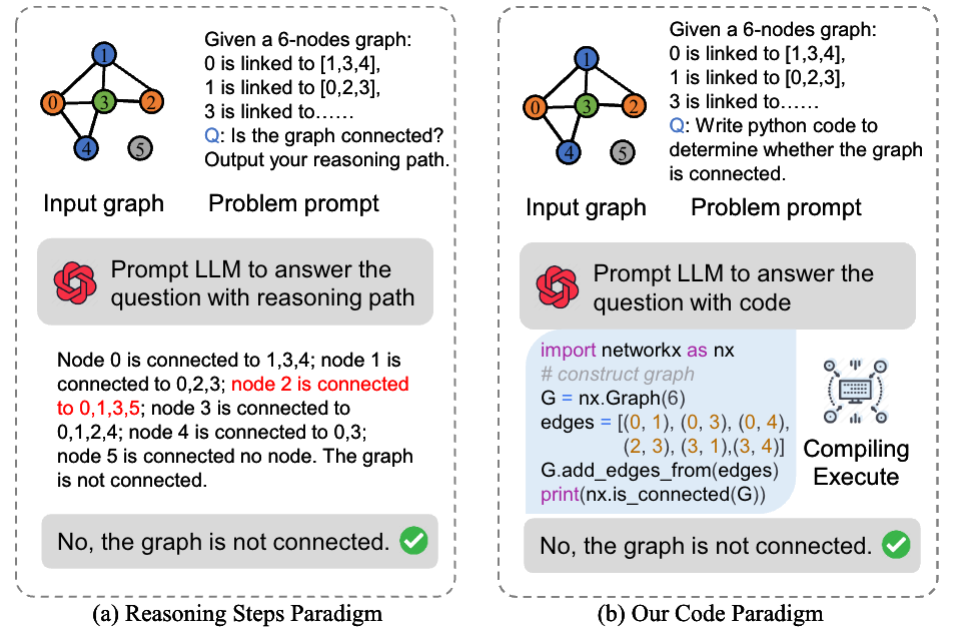
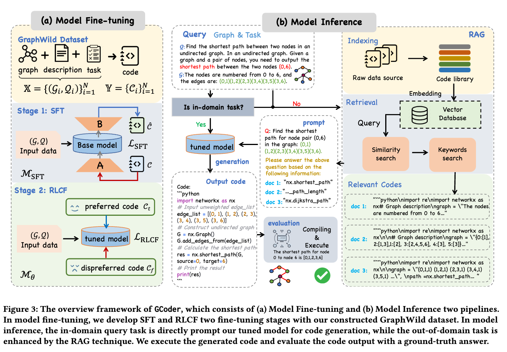
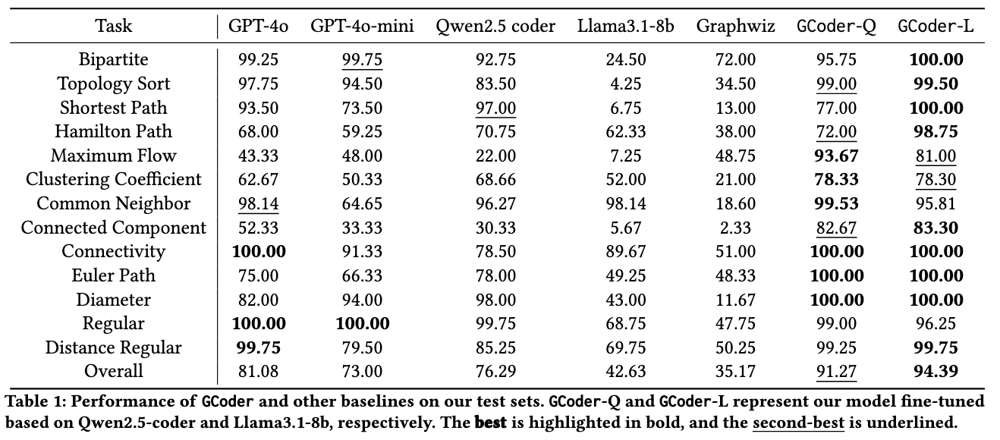
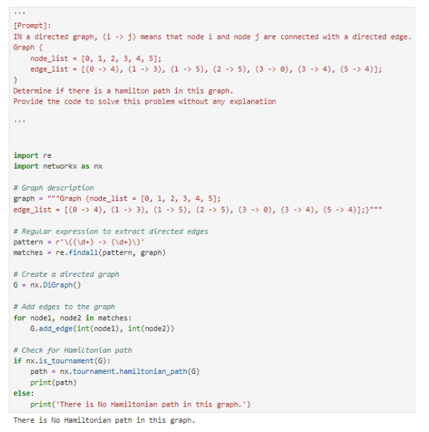
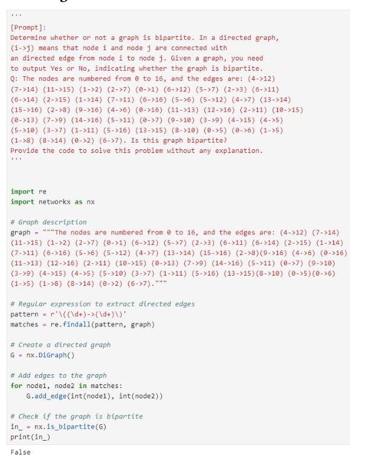

# GCoder: Improving Large Language Model for Generalized Graph Problem Solving
### Abstract
Large Language Models (LLMs) have demonstrated strong reasoning abilities, making them suitable for complex tasks such as graph computation. Traditional reasoning steps paradigm for graph problems is hindered by unverifiable steps, limited long-term reasoning, and poor generalization to graph variations. To overcome these limitations, we introduce GCoder, a code-based LLM designed to enhance problem-solving in generalized graph computation problems. Our method involves constructing a comprehensive training dataset, GraphWild, featuring diverse graph formats and algorithms. We employ a multi-stage training process, including Supervised Fine-Tuning (SFT) and Reinforcement Learning from Compiler Feedback (RLCF), to refine model capabilities. For unseen tasks, a hybrid retrieval technique is used to augment performance. Experiments demonstrate that GCoder outperforms GPT-4o, with an average accuracy improvement of **16.42\%** across various graph computational problems. Furthermore, GCoder efficiently manages large-scale graphs with millions of nodes and diverse input formats, overcoming the limitations of previous models focused on the reasoning steps paradigm. This advancement paves the way for more intuitive and effective graph problem-solving using LLMs.

<p align="center">

</p>

(a) While the reasoning step paradigm outputs correct results, intermediate reasoning can be wrong (i.e., red reasoning step, node 2 is not connected to 0 and 5). (b) Our code paradigm processes graph problems with programming. More examples can be found in our Appendix B.


### Framework

<p align="center">

</p>

### Main Results

<p align="center">

</p>


#### Showcases of prompt and LLM generated code
<div style="display: flex; justify-content: space-between;">
  
  
</div>

### Environment Setup
```bash
cd Train and Evaluation/LLaMA-Factory
pip install -r requirements.txt
```

### Quick Start
```python
import os
import torch
from transformers import AutoModelForCausalLM, AutoTokenizer

# Load the tokenizer
tokenizer = AutoTokenizer.from_pretrained('meta-llama/Meta-Llama-3.1-8B-Instruct')

# Load the model with quantization
model = AutoModelForCausalLM.from_pretrained(
    'GCoder/Llama3.1-8B',
    local_files_only=False,
    torch_dtype=torch.float16  # Use float16 precision
)
model.eval()
device = torch.device("cuda" if torch.cuda.is_available() else "cpu")
model.to(device)
task_name = 'kcore'
# Input text
input_text ='<|begin_of_text|><|start_header_id|>user<|end_header_id|>\n\n'
input_text =  input_text + """
[Prompt]: 
Given an undirected graph where Node QPX is connected to nodes QDB, FOQ, BHA, EJG, EBX, SVP, LJJ, MZJ, EZR; Node QDB is connected to nodes FOQ, EJG, AAL, EBX, SVP, LJJ, EZR, QPX; Node FOQ is connected to nodes BHA, EJG, EBX, LJJ; Node BHA is connected to nodes EJG, SVP, MZJ, QPX, FOQ; Node EJG is connected to nodes AAL, EBX, EZR, QPX, QDB, WSE; Node EBX is connected to nodes LJJ, EZR, BHA, EJG; Node SVP is connected to nodes MZJ, QDB, EJG, AAL; Node LJJ is connected to nodes EJG, SVP; Node MZJ is connected to nodes QDB, WSE, BHA, AAL, EBX, SVP; Node EZR is connected to nodes QDB, EJG, AAL, SVP, TGJ; Node AAL is connected to nodes SVP, LJJ, MZJ, EZR, QPX, FOQ, WSE, EJG; Node WSE is connected to nodes EJG, AAL, TGJ, QPX, FOQ; Node TGJ is connected to nodes LJJ, EZR, BHA, EJG, SVP. The task is to find the k-core of this graph, k=3.
Output the nodes of the k-core subgraph.
"""

text = "Provide the code to solve this problem without any explanation."

# Encode input
inputs = tokenizer(input_text, return_tensors='pt').to(device)

# Inference
with torch.no_grad():
    outputs = model.generate(**inputs, max_new_tokens=3000)

# Decode output
output_text = tokenizer.decode(outputs[0], skip_special_tokens=True)

# Save output_text to a text file
with open(f'./output/{task_name}.txt', 'w', encoding='utf-8') as f:
    f.write(output_text)
```

### Train
```bash
git clone --depth 1 https://github.com/hiyouga/LLaMA-Factory.git
cd Train and Evaluation/LLaMA-Factory
pip install -e ".[torch,metrics]"
```

#### SFT
```bash
llamafactory-cli train examples/train_lora/llama3_lora_sft.yaml
```

#### RLCF
```bash
llamafactory-cli train examples/train_lora/llama3_lora_dpo.yaml
```


### Run GCoder
```bash
cd Train and Evaluation
python vllm_infer_main_table.py
```


